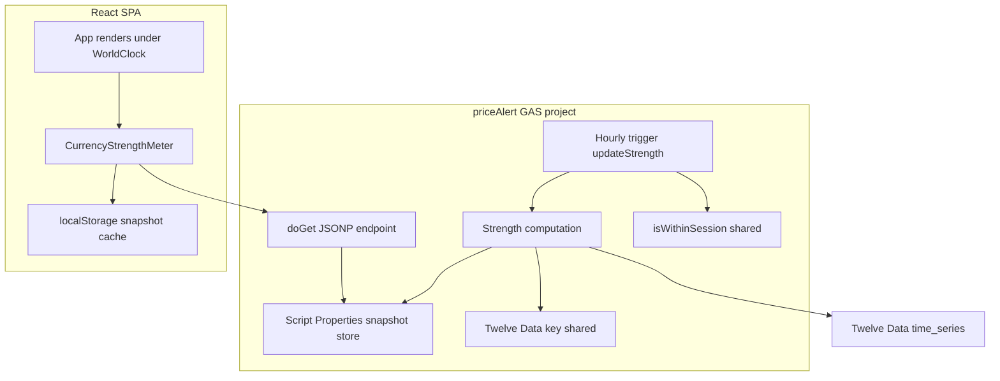
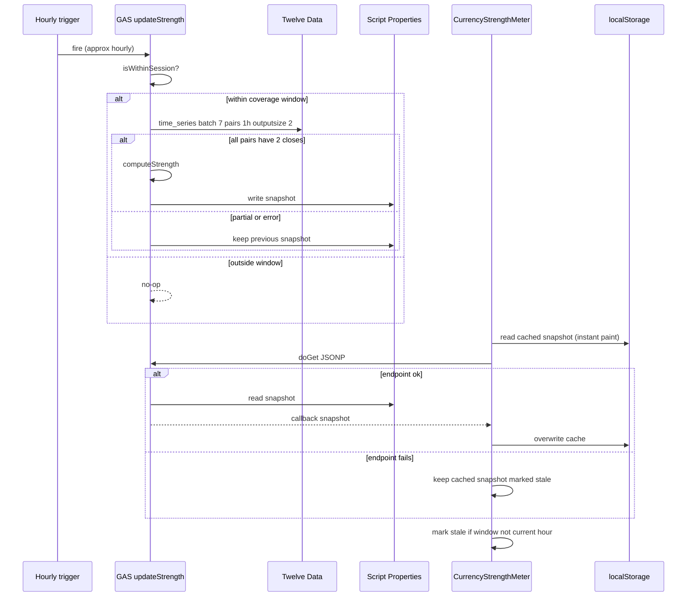

# Technical Design: Currency Strength Meter

## Overview

**Purpose**: This feature delivers an hourly currency-strength indicator to forex traders using the FX Lot Size Calculator, showing which of the 8 supported currencies are strengthening or weakening relative to each other over the last completed clock hour.

**Users**: Retail forex traders will glance at the meter alongside the calculator and WorldClock to gauge momentum before sizing a position.

**Impact**: Adds a server-computed, cached data path to the existing priceAlert Google Apps Script (GAS) project and a new read-only display component to the single-page React app. It does not modify the lot-size calculator, its rate fetching, or the price-move alert.

### Goals
- Compute a per-currency equal-weighted strength score over the last completed clock hour, server-side, once per hour within the coverage window.
- Serve a shared, cached snapshot to all clients at near-zero marginal Twelve Data cost.
- Render a collapsible ranked bar list that never blocks the calculator.

### Non-Goals
- Rolling/sub-hourly or 24/5 strength (deliberately windowed per ADR-0002).
- Adding currencies beyond the existing 8.
- Client-side strength computation or any client-held Twelve Data credential.
- Alerting/push on strength changes (the price-move alert is a separate concern).

## Boundary Commitments

### This Spec Owns
- The strength score definition and its server-side computation from 7 X/JPY hourly series.
- The hourly recompute schedule and the cached snapshot state in the priceAlert GAS project.
- The `doGet` JSONP snapshot endpoint contract (`StrengthSnapshotResponse`).
- The client `CurrencyStrengthMeter` component: fetch, `localStorage` cache, staleness display, collapse UI.

### Out of Boundary
- The price-move alert logic and its trigger (shares only the GAS project, key, and `isWithinSession`).
- The calculator's rate fetching (`fetchCurrencyRates`) and calculator state.
- Twelve Data account/quota provisioning and key rotation (operator concern).

### Allowed Dependencies
- Twelve Data `time_series` endpoint (external, key from Script Properties).
- The priceAlert GAS project's `isWithinSession`, `PropertiesService`, and time-trigger infrastructure.
- The client's existing JSONP and `localStorage` patterns.

### Revalidation Triggers
- Change to the `StrengthSnapshotResponse` shape or field semantics.
- Change to the coverage window (`isWithinSession`) shared with the alert.
- Change to the currency set (the 8 supported currencies).
- Twelve Data `time_series` contract or credit-cost changes.

## Architecture

### Existing Architecture Analysis
- **priceAlert GAS project**: holds `TWELVE_DATA_API_KEY` in Script Properties, a weekday 15:00–26:00 JST gate (`isWithinSession`), JSON state via `PropertiesService`, and a 1-minute time trigger. Strength reuses the key, the gate, and the state mechanism; it adds its own hourly trigger and endpoint.
- **Client (`App.tsx`)**: JSONP-over-`<script>` fetch (`fetchFromGAS`), lazy `useState`+`localStorage` persistence, and a self-contained inline display component (`WorldClock`). The meter mirrors these and does not read or write calculator state.
- **Integration points maintained**: the existing GAS rate endpoint and alert are untouched; only additive files/functions are introduced.

### Architecture Pattern & Boundary Map



**Architecture Integration**:
- **Selected pattern**: Server-computed cached snapshot with a thin JSONP read path (per ADR-0002).
- **Domain/feature boundaries**: Compute + cache is owned server-side; the client only renders. No shared mutable state between strength and alert (strength uses its own Script Properties keys and trigger).
- **Existing patterns preserved**: JSONP transport, `localStorage` persistence, inline self-contained display component, session-gated GAS execution.
- **New components rationale**: A GAS compute/endpoint file (new server responsibility) and a client component (new UI responsibility) — each a single, isolated concern.
- **Steering compliance**: Static SPA + external GAS; no backend added; TypeScript strict, no `any`.

**Dependency direction (client)**: Types → helpers (formatting/staleness) → `CurrencyStrengthMeter` → `App`. Each layer imports only leftward.

### Technology Stack

| Layer | Choice / Version | Role in Feature | Notes |
|-------|------------------|-----------------|-------|
| Frontend | React 19 + TypeScript ~5.7 (strict) | `CurrencyStrengthMeter` component, JSONP fetch, `localStorage` cache, collapse UI | Reuses existing patterns; Tailwind v4 for the bars |
| Backend / Services | Google Apps Script (V8) | Hourly `updateStrength` trigger, `computeStrength`, `doGet` JSONP endpoint | New `.gs` file in the existing priceAlert project |
| Data / Storage | GAS `PropertiesService` (server), `localStorage` (client) | Cached snapshot server-side; last-seen snapshot client-side | Snapshot is small JSON (~8 numbers + labels) |
| External | Twelve Data `time_series` | Two most recent 1h closes for 7 X/JPY pairs | Batch call, 7 credits/recompute, ~77/day |

## File Structure Plan

### Directory Structure
```
gas/
├── priceAlert.gs           # unchanged (alert)
└── currencyStrength.gs     # NEW: updateStrength(), computeStrength(), doGet(), setupStrength()
src/
├── App.tsx                 # MODIFIED: render <CurrencyStrengthMeter/> under <WorldClock/>
├── CurrencyStrengthMeter.tsx  # NEW: component (fetch + localStorage + collapse + bars)
└── lib/
    └── strength.ts         # NEW: pure helpers + types (sort, staleness, formatting)
```

### Modified Files
- `src/App.tsx` — Import and render `<CurrencyStrengthMeter />` beneath `<WorldClock />`. No other change.
- `.env.example` — Add `VITE_GAS_STRENGTH_URL` reference.
- `gas/README.md` — Add strength setup steps (`setupStrength`, deploy as web app for `doGet`).

> `gas/currencyStrength.gs` lives in the same GAS project as `priceAlert.gs`, sharing Script Properties (Twelve Data key) and `isWithinSession`. The strength math is unit-tested via `src/lib/strength.ts` where the same formula is mirrored for the sort/label helpers; the authoritative computation is in GAS.

## System Flows

### Hourly recompute (server) and read (client)


Key decisions: the Twelve Data 1h bars (not the trigger clock) define the window boundaries; a partial/failed fetch never overwrites a good snapshot; the client paints from `localStorage` first, then reconciles with the endpoint.

## Requirements Traceability

| Requirement | Summary | Components | Interfaces | Flows |
|-------------|---------|------------|------------|-------|
| 1.1–1.5 | Strength score definition & computation | `computeStrength` (GAS) | `StrengthSnapshot` | Recompute |
| 2.1–2.5 | Hourly recompute, cache, JSONP serve, env var | `updateStrength`, `doGet` (GAS); `CurrencyStrengthMeter` | `StrengthSnapshotResponse` | Recompute + read |
| 3.1–3.4 | Coverage window & staleness | `updateStrength` (`isWithinSession`); `strength.ts` `isStale` | `StrengthSnapshot` | Both |
| 4.1–4.6 | Collapsible ranked bar list + localStorage paint | `CurrencyStrengthMeter`; `strength.ts` `sortScores` | `StrengthMeterProps` | Read |
| 5.1–5.4 | Graceful degradation / failure | `CurrencyStrengthMeter`; `updateStrength` retain-on-error | `StrengthSnapshotResponse` | Both |
| 6.1–6.3 | Quota & secret constraints | `updateStrength` (session-gated), GAS key access | — | Recompute |

## Components and Interfaces

| Component | Domain/Layer | Intent | Req Coverage | Key Dependencies (P0/P1) | Contracts |
|-----------|--------------|--------|--------------|--------------------------|-----------|
| `currencyStrength.gs` | Server (GAS) | Compute hourly snapshot, cache, serve JSONP | 1, 2, 3, 5, 6 | Twelve Data (P0), Script Properties (P0), `isWithinSession` (P0) | Batch, API, State |
| `strength.ts` | Client helpers | Types + pure sort/staleness/format | 3, 4 | none | Service |
| `CurrencyStrengthMeter.tsx` | Client UI | Fetch, cache, collapse, render bars | 2, 4, 5 | `strength.ts` (P0), `VITE_GAS_STRENGTH_URL` (P0) | State |

### Server (GAS)

#### currencyStrength.gs

| Field | Detail |
|-------|--------|
| Intent | Compute the hourly strength snapshot from 7 X/JPY series, cache it, and serve it as JSONP |
| Requirements | 1.1, 1.2, 1.3, 1.4, 1.5, 2.1, 2.2, 2.3, 2.4, 3.1, 3.2, 5.4, 6.1, 6.2 |

**Responsibilities & Constraints**
- Owns the strength computation and the cached snapshot (own Script Properties key `STRENGTH_SNAPSHOT`; own trigger handler `updateStrength`).
- Recomputes only while `isWithinSession(now)` is true (shared gate).
- Never overwrites a good snapshot with an error/partial result.
- Reads `TWELVE_DATA_API_KEY` only from Script Properties; never returns it.

**Dependencies**
- Outbound: Twelve Data `time_series` — window closes (External, P0).
- Inbound: `CurrencyStrengthMeter` via `doGet` (P0).
- Internal: `isWithinSession` from priceAlert (P0), `PropertiesService` (P0).

**Contracts**: Batch [x] / API [x] / State [x]

##### Batch / Job Contract
- **Trigger**: time-based, `everyHours(1)` (created once via `setupStrength()`).
- **Input / validation**: batch `time_series` for the 7 symbols `USD/JPY,EUR/JPY,GBP/JPY,AUD/JPY,NZD/JPY,CAD/JPY,CHF/JPY`, `interval=1h`, `outputsize=2`. Each symbol must have `values[0].close` and `values[1].close`; otherwise abort (no write).
- **Computation**: for each currency `C`, let `r_C = close_end(C/JPY) / close_start(C/JPY) − 1` (with `r_JPY = 0`). `strength(C) = average over D ≠ C of ((1+r_C)/(1+r_D) − 1) × 100`. Scores sum to ≈ 0.
- **Output / destination**: write `StrengthSnapshot` JSON to Script Properties key `STRENGTH_SNAPSHOT`.
- **Idempotency & recovery**: idempotent per hour (latest write wins); on any fetch/parse error, retain the previous value.

##### API Contract
| Method | Endpoint | Request | Response | Errors |
|--------|----------|---------|----------|--------|
| GET | GAS web-app URL (`?callback=fn`) | `callback` query param | JSONP `fn(StrengthSnapshotResponse)` | Returns `{result:"error"}` payload if no snapshot; transport failures handled client-side |

##### State Management
- **State model**: single JSON snapshot in Script Properties (`STRENGTH_SNAPSHOT`).
- **Persistence & consistency**: last-successful snapshot only; error results are not persisted.
- **Concurrency strategy**: single-writer (the hourly trigger); reads are stale-tolerant.

**Implementation Notes**
- Integration: add to the existing project so `isWithinSession`/key are in scope; `setupStrength()` registers the hourly trigger; deploy as Web App (execute as me, access anyone) so `doGet` is reachable via JSONP.
- Validation: guard warm-up (`values.length >= 2`) and per-symbol `status === "ok"`.
- Risks: Twelve Data bar boundary vs. JST clock hour — window labels derive from bar `datetime` (converted to JST), not the trigger time.

### Client

#### strength.ts (helpers + types)

**Contracts**: Service [x] (pure functions)

##### Service Interface
```typescript
export type CurrencyCode =
  | 'JPY' | 'USD' | 'EUR' | 'GBP' | 'AUD' | 'NZD' | 'CAD' | 'CHF';

export interface StrengthScore {
  currency: CurrencyCode;
  changePct: number; // signed % over the window
}

export interface StrengthSnapshot {
  windowStart: string;  // JST "HH:mm" or ISO
  windowEnd: string;    // JST "HH:mm" or ISO
  computedAt: number;   // epoch ms (UTC)
  scores: StrengthScore[];
}

// JSONP payload from doGet: success carries a snapshot, error carries a reason.
export type StrengthSnapshotResponse =
  | ({ result: 'success' } & StrengthSnapshot)
  | { result: 'error'; error: string };

export function sortScores(scores: StrengthScore[]): StrengthScore[];      // desc by changePct
export function isStale(snapshot: StrengthSnapshot, now: Date): boolean;   // window not the last completed clock hour
export function formatWindowLabel(snapshot: StrengthSnapshot): string;     // e.g. "09:00–10:00"
```
- Preconditions: `scores` contains the 8 currencies.
- Postconditions: `sortScores` returns a new array sorted descending; `isStale` is pure.
- Invariants: helpers never fetch or mutate inputs.

#### CurrencyStrengthMeter.tsx

| Field | Detail |
|-------|--------|
| Intent | Render the collapsible ranked bar list; fetch snapshot via JSONP; cache in `localStorage`; show staleness/unavailable states |
| Requirements | 2.5, 4.1, 4.2, 4.3, 4.4, 4.5, 4.6, 5.1, 5.2, 5.3, 6.3 |

**Responsibilities & Constraints**
- Reads `VITE_GAS_STRENGTH_URL`; if unset, renders the collapsed "unavailable" header (feature simply inert).
- Paints from `localStorage` (`STRENGTH_SNAPSHOT_CACHE`) on mount, then fetches and reconciles.
- Collapsed by default; toggling expands the 8-row list.
- Holds no credential; only the snapshot and endpoint URL.
- Must not affect calculator state or block rendering on failure.

**Dependencies**
- Outbound: `currencyStrength.gs` `doGet` via JSONP (P0).
- Internal: `strength.ts` helpers (P0), `localStorage` (P1).

**Contracts**: State [x]

##### State Management
- **State model**: `snapshot: StrengthSnapshot | null`, `expanded: boolean`, `loading: boolean`.
- **Persistence & consistency**: last snapshot persisted to `localStorage`; on successful fetch, overwrite; on failure, keep and mark stale.
- **Concurrency strategy**: single JSONP request per mount (mirrors `fetchFromGAS`, 10s timeout + cleanup).

**Implementation Notes**
- Integration: rendered under `<WorldClock/>` in `App.tsx`; component owns its own JSONP helper modeled on `fetchFromGAS` (unique callback name, `<script>` inject, timeout, cleanup).
- Validation: treat `result !== 'success'` or absent snapshot as "unavailable"; `isStale` drives the 「古い」 badge; positive vs negative `changePct` drives diverging bar color/direction.
- Risks: JSONP script-load failure → resolve to cached/unavailable, never throw into React render.

## Data Models

### Domain Model
- **StrengthSnapshot** (value object, immutable): one computed window. Invariants — exactly 8 `scores`, `windowStart < windowEnd`, scores sum ≈ 0.
- No aggregates or persistence beyond the single latest snapshot on each side (server cache, client cache).

### Data Contracts & Integration
**JSONP payload (`doGet`)** — success:
```json
{ "result": "success",
  "windowStart": "09:00", "windowEnd": "10:00",
  "computedAt": 1727579400000,
  "scores": [ { "currency": "USD", "changePct": 0.42 }, { "currency": "JPY", "changePct": -0.31 } ] }
```
error: `{ "result": "error", "error": "no snapshot" }`.
- Serialization: JSONP (`callback(<json>)`), matching the existing rate endpoint.
- Compatibility: additive fields only; shape changes are a Revalidation Trigger.

## Error Handling

### Error Strategy
- **Server**: fetch/parse/warm-up failures → skip write, retain last good snapshot (5.4). No client-visible error state is persisted.
- **Client**: transport failure → fall back to `localStorage` snapshot marked stale (5.1); no snapshot ever → "unavailable" placeholder (5.2). Strength never blocks or errors the calculator (5.3).

### Error Categories and Responses
- **External/System (Twelve Data / GAS down)**: graceful degradation to stale or unavailable.
- **Business (warm-up / <2 bars)**: no snapshot written; client shows prior or unavailable.
- **User**: none (read-only, no input).

### Monitoring
- Server uses `Logger.log` (consistent with priceAlert) for fetch failures and skipped writes. No new monitoring infra.

## Testing Strategy

### Unit Tests (`src/lib/__tests__/strength.test.ts`)
- `sortScores` orders descending and is stable for ties.
- `isStale` true when snapshot window precedes the last completed clock hour; false when current.
- `formatWindowLabel` renders `HH:mm–HH:mm` in JST.
- Strength math fixture: given known closes, scores sum ≈ 0 and ranking matches expectation.

### Integration Tests
- JSONP helper resolves on `callback(success)`, rejects/【cleans up】on timeout and `script.onerror` (mirrors `fetchFromGAS`).
- `CurrencyStrengthMeter` paints from `localStorage` before network, then reconciles on success.
- Failure path: no `VITE_GAS_STRENGTH_URL` / error payload → "unavailable" header; calculator remains interactive.

### E2E/UI Tests (Playwright, optional)
- Collapsed-by-default header; expand shows 8 sorted rows with diverging bars.
- Stale badge appears when the cached snapshot is old.

## Security Considerations
- Twelve Data key stays in the priceAlert GAS Script Properties; never in the client bundle or JSONP payload (6.2, 6.3).
- `doGet` returns only computed strength numbers and window labels — no secrets, no raw account data.
- Web-app deployment is public read (JSONP requirement); acceptable because the payload is non-sensitive market-derived data.

## Performance & Scalability
- **Quota**: deterministic 7 credits/recompute × 11 hourly recomputes = ~77 req/day, within the ~140/day headroom shared with the alert (6.1).
- **Client**: one JSONP request per mount; instant paint from `localStorage`; 8-row render is negligible.
